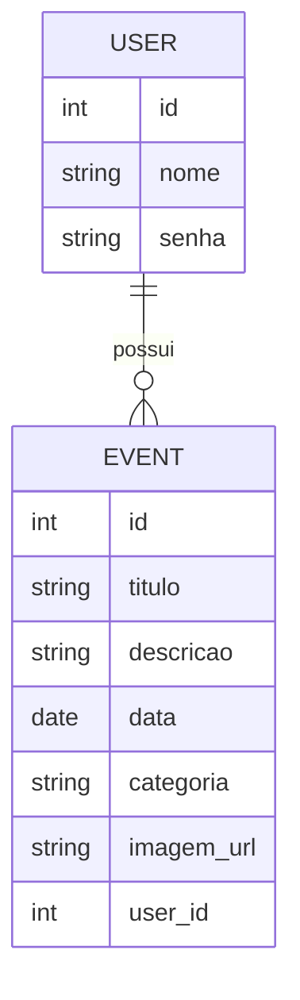

# 🛠️ Especificação Técnica (Tech Spec) - LifeTrack
Este documento descreve o modelo de dados da aplicação LifeTrack.

## 1. Modelo de Dados (Diagram ER)
Abaixo está o Diagrama Entidade-Relacionamento (DER) que representa a estrutura de dados da aplicação LifeTrack, evidenciando as principais entidades e seus relacionamentos.

## 2. Dicionário de Dados
Breve explicação das tabelas principais sobre a estrutura de dados da aplicação LifeTrack:
- **Usuários:** Responsável por armazenar os dados básicos do usuário da aplicação. Mesmo que o sistema não implemente autenticação completa no MVP, essa entidade permite estruturar a aplicação para múltiplos usuários no futuro.
  - **id:** Identificador único gerado pelo JSON Server (Number).
  - **nome:** Nome do usuário utilizado para identificação na aplicação.
- **Eventos:** Registra todos os eventos da linha do tempo do usuário. É a entidade central do sistema. A partir dela são geradas as visualizações da timeline e os dados para a retrospectiva (Wrapped).
  - **id:** Identificador único do evento (Number).
  - **titulo:** Nome do evento (campo obrigatório).
  - **descricao:** Texto descritivo opcional com detalhes do evento.
  - **data:** Data em que o evento ocorreu (formato Date).
  - **categoria:** Classificação do evento (ex: Estudos, Trabalho, Pessoal). Utilizada para filtros e análises.
  - **imagem_url:** URL de uma imagem associada ao evento (opcional).
  - **user_id:** Chave estrangeira que vincula o evento ao usuário (padrão utilizado pelo JSON Server para relacionamentos).

## 3. Rotas da API (JSON Server)
A aplicação consome uma API fake simulada com JSON Server. Abaixo os principais endpoints:

**Usuários:**
* `GET /usuarios` → Retorna a lista de usuários.
* `POST /usuarios` → Cadastra um novo usuário.

**Eventos:**
* `GET /eventos` → Retorna todos os eventos.
* `GET /eventos?user_id=1` → Retorna eventos de um usuário específico.
* `POST /eventos` → Cadastra um novo evento.
* `DELETE /eventos/:id` → Remove um evento.

## 4. Versões das Tecnologias Utilizadas
* Bootstrap v5.3.8.
* 
