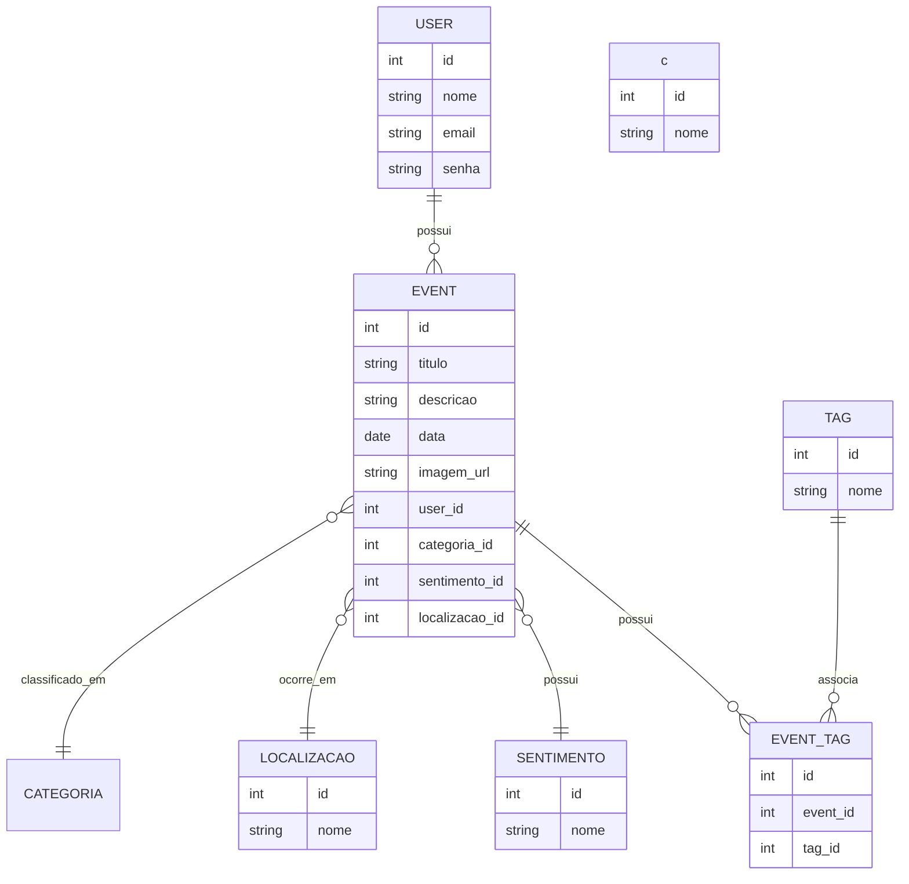

# 🛠️ Especificação Técnica (Tech Spec) - LifeTrack
Este documento descreve o modelo de dados da aplicação LifeTrack.

## 1. Modelo de Dados (Diagram ER)
Abaixo está o Diagrama Entidade-Relacionamento (DER) que representa a estrutura de dados da aplicação LifeTrack, evidenciando as principais entidades e seus relacionamentos.

## 2. Dicionário de Dados
Descrição das principais entidades da aplicação LifeTrack:

### Usuários
Responsável por armazenar os dados básicos do usuário da aplicação. Mesmo que o sistema não implemente autenticação completa no MVP, essa entidade permite estruturar a aplicação para múltiplos usuários no futuro.

  - **id:** Identificador único gerado pelo JSON Server.
  - **nome:** Nome do usuário utilizado para identificação na aplicação.
  - **email:** Email utilizado para autenticação (deve ser único).
  - **senha:** Senha do usuário.

### Eventos
Entidade central da aplicação. Armazena os momentos registrados pelo usuário.

  - **id:** Identificador único do evento.
  - **titulo:** Nome do evento (obrigatório).
  - **descricao:** Texto descritivo com detalhes do evento.
  - **data:** Data em que o evento ocorreu (obrigatório).
  - **categoria:** Classificação do evento.
  - **imagem_url:** URL de uma imagem associada ao evento.
  - **user_id:** Relacionamento com usuário.
  - **sentimento_id:** Referência ao sentimento associado.
  - **localizacao_id:** Referência à localização do evento.

### Tags
Representam palavras-chave associadas aos eventos.

  - **id:** Identificador único.
  - **nome:** Nome da tag.

### Evento_Tags (Tabela associativa)
Relaciona eventos e tags (N:N).

  - **id:** Identificador.
  - **event_id:** Referência ao evento.
  - **tag_id:** Referência à tag.

### Sentimentos
Representam o estado emocional associado ao evento.

  - **id:** Identador único.
  - **nome:** Nome do sentimento.

### Localização
Representa o local onde o evento ocorreu.

  - **id:** Identificador único.
  - **nome:** Nome do local.

## 3. Rotas da API (JSON Server)
A aplicação consome uma API fake simulada com JSON Server. Abaixo os principais endpoints:

**Usuários:**
* `GET /usuarios` → Lista usuários.
* `POST /usuarios` → Cadastra um novo usuário.

**Eventos:**
* `GET /eventos` → Lista eventos.
* `GET /eventos?user_id=1` → Retorna eventos de um usuário específico.
* `POST /eventos` → Cadastra um evento.
* `DELETE /eventos/:id` → Remove um evento.

**Tags:**
* `GET /tags` → Lista todas as tags.
* `POST /tags` → Cria uma tag.

**Evento_Tags:**
* `GET /event_tag` → Lista relações.
* `POST /event_tag` → Associa tag ao evento.

**Sentimentos:**
* `GET /sentimentos` → Lista sentimentos.
* `POST /sentimentos` → Adiciona um sentimento.

**Localização:**
* `GET /localizacoes` → Lista locais.
* `POST /localizacoes` → Adiciona um local.

## 4. Lógica de Geração de Insights (Frontend)
A jornada do usuário não é armazenada no banco, sendo gerada dinamicamente no frontend com base nos eventos.

**Exemplos de processamento:**
* Contagem total de eventos.
* Agrupamento por categoria.
* Frequência de tags.
* Distribuição por localização.
* Identificação de padrões (mais recorrentes).

**Saídas:**
* Cards com estatísticas.
* Mensagens interpretativas. Ex: "Você registrou 40 momentos de aprendizado”.

## 5. Versões das Tecnologias Utilizadas:
Para garantir a compatibilidade de componentes e a correta interpretação da aplicação, este projeto utiliza as seguintes tecnologias e suas respectivas versões:

* Bootstrap v5.3.8.
* Cloudinary API v1_1.
* Mapbox API v5.
