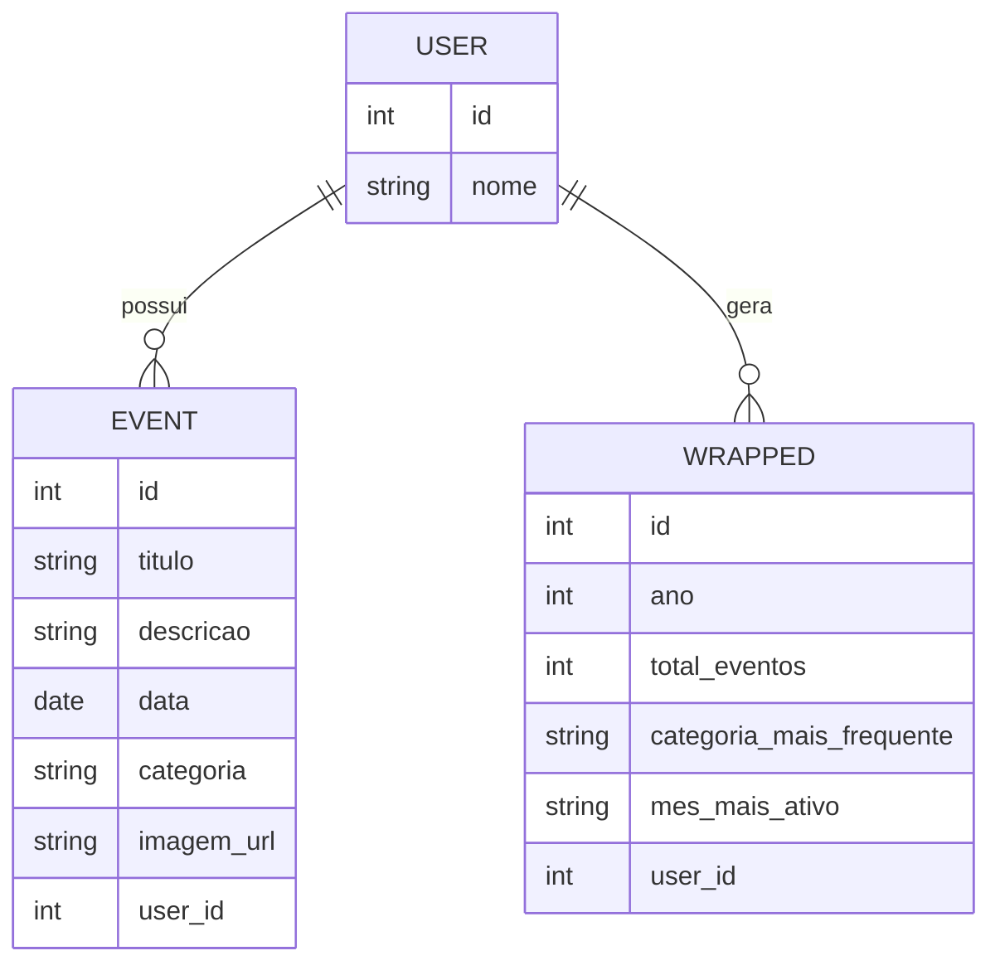

# 🛠️ Especificação Técnica (Tech Spec) - LifeTrack
Este documento descreve o modelo de dados da aplicação LifeTrack.

## 1. Modelo de Dados (Diagram ER)
Abaixo está o Diagrama Entidade-Relacionamento (DER) que representa a estrutura de dados da aplicação LifeTrack, evidenciando as principais entidades e seus relacionamentos.

## 2. Dicionário de Dados
